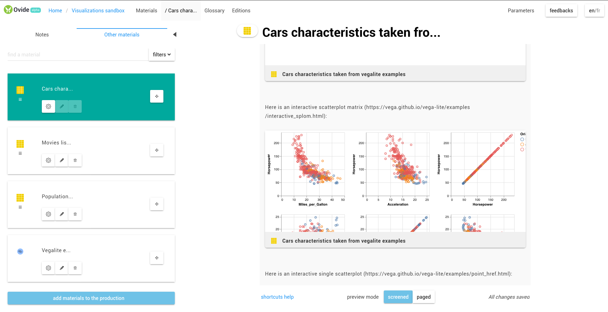

Ovide [alpha]
===

## *an experimental application for context-rich & polymorphic scholarly publishing.*

[](https://github.com/peritext/ovide/blob/master/LICENSE)
[](https://github.com/peritext/ovide/blob/master/LICENSE)
[](https://twitter.com/intent/tweet?text=an%20experimental%20application%20for%20context-rich%20%26%20polymorphic%20scholarly%20publishing&url=https://www.peritext.github.io/ovide&hashtags=multimodal,polymorphic,publishing,context-rich,academic,media-rich)



Ovide is an editor built with the [Peritext ecosystem](https://peritext.github.io).

It is provided both as a [web](https://www.peritext.github.io/ovide) and [desktop](https://github.com/peritext/ovide/releases) application.

# Installation for use

You can [test Ovide online](https://peritext.github.io/ovide/) or go the [releases](https://github.com/peritext/ovide/releases) page in order to download Ovide desktop version for your Operation System.

# Installation for development

As a prerequisite you will need [git](https://git-scm.com/) and [nodejs](https://nodejs.org/en/) softwares installed.

Then:

1. Get a google api key in google dev console -> https://console.developers.google.com then enable youtube and maps apis.
3. Open a terminal/bash and type the following lines :

```
git clone https://github.com/peritext/ovide
cd ovide
npm install
cp app/config/sample.json app/config/default.json
```

4. Fill `app/config/default.json`  with your credentials.

# Main dev scripts

```
# run in electron/dev mode with hot reloading
npm run dev:electron

# run in web/dev mode with hot reloading
npm run dev:web

# pack electron application for all platforms
npm run pack

# build web version for production
npm run build:web

# diagnose and fix js code style and inconsistencies
npm run lint:fix

```
    
# [advanced users] Modifying ovide configuration

Ovide is designed to allow an easy forking and customization in order to change the types of resources, contextualizers and edition templates available in the app.

Everything about this happens in `app/src/peritextConfig.render.js` : just modify the JS object exposed by this module to `require` specific schemas or components that you would want to use instead of the default config.

*Note: more doc may be written about ovide customization at some point in the future if the tool proves useful for an extended community*.


# Contributing to ovide

The source code of Ovide is published under free license [AGPL-3.0](https://www.gnu.org/licenses/agpl-3.0.en.html). 

**This software is currently in alpha stage (which means: lots of bugs and performance issues), and contributions/PR to improve it are more than welcome.**

Besides, please do not hesitate to [submit new issues](https://github.com/peritext/ovide/issues/new) to the project's repository in order to signal bugs or missing features.

## Acknowledgements

Ovide is a technology that was developped as a generic spinoff of several projects, notably funded by MESR/Université Rennes 2 and médialab Sciences Po.

See the [peritext project website](https://peritext.github.io) for more information about Ovide history.

Besides, it relies on numerous `npm` packages and libraries for which here are some acknowledgements :

- **Sindre Sorhus** *sindresorhus@gmail.com* (176 packages)
- **Jon Schlinkert** *github@sellside.com* (82 packages)
- **Graham Fairweather** *xotic750@gmail.com* (37 packages)
- **Isaac Z. Schlueter** *isaacs@npmjs.com* (35 packages)
- **Kevin Mårtensson** *kevinmartensson@gmail.com* (34 packages)
- **Mike Bostock** *mike@ocks.org* (34 packages)
- Unknown (31 packages)
- **Titus Wormer** *tituswormer@gmail.com* (29 packages)
- **James Halliday** *mail@substack.net* (28 packages)
- **John-David Dalton** *john.david.dalton@gmail.com* (28 packages)
- **Jordan Harband** *ljharb@gmail.com* (28 packages)
- **Sebastian McKenzie** *sebmck@gmail.com* (26 packages)
- **Ben Briggs** *beneb.info@gmail.com* (24 packages)
- **TJ Holowaychuk** *tj@vision-media.ca* (23 packages)
- **Jeffrey Heer** (21 packages)
- **Tobias Koppers @sokra** (21 packages)
- **Robin de Mourat** (20 packages)
- Unknown (19 packages)
- **Mathias Buus** *mathiasbuus@gmail.com* (19 packages)
- **Jake Verbaten** *raynos2@gmail.com* (18 packages)
- **Fedor Indutny** *fedor@indutny.com* (18 packages)
- **Rebecca Turner** *me@re-becca.org* (15 packages)
- **Forbes Lindesay** *forbes@lindesay.co.uk* (15 packages)
- **Shinnosuke Watanabe** *snnskwtnb@gmail.com* (15 packages)
- **Sven Sauleau** (14 packages)
- **Shane Osbourne** *shane.osbourne8@gmail.com* (13 packages)
- **Domenic Denicola** *domenic@domenicdenicola.com* (11 packages)
- **Jonathan Ong** *jonathanrichardong@gmail.com* (11 packages)
- **Douglas Wilson** *doug@somethingdoug.com* (11 packages)
- **Felix Böhm** *me@feedic.com* (10 packages)
- **Vladimir Krivosheev** (10 packages)
- **Benjamin Lupton** *b@lupton.cc* (9 packages)
- **Vsevolod Strukchinsky** *floatdrop@gmail.com* (9 packages)
- **Joshua Appelman** *jappelman@xebia.com* (8 packages)
- **Calvin Metcalf** *calvin.metcalf@gmail.com* (8 packages)
- **Arnout Kazemier** *opensource@3rd-eden.com* (8 packages)
- **Mathias Bynens** *mathias@qiwi.be* (8 packages)
- **2012+ Bevry Pty Ltd** *us@bevry.me* (8 packages)
- **Dominic Tarr** *dominic.tarr@gmail.com* (8 packages)
- **Matt DesLauriers** *dave.des@gmail.com* (7 packages)
- **JD Ballard** *i.am.qix@gmail.com* (7 packages)
- **Benjamin Coe** *ben@npmjs.com* (7 packages)
- **Joel Kemp** *joel@mrjoelkemp.com* (7 packages)
- **Feross Aboukhadijeh** *feross@feross.org* (7 packages)
- **JP Richardson** *jprichardson@gmail.com* (6 packages)
- **Simon Lydell** (6 packages)
- **Thomas Watson Steen** *w@tson.dk* (6 packages)
- **Mikeal Rogers** *mikeal.rogers@gmail.com* (6 packages)
- **Jake Luer** *jake@alogicalparadox.com* (6 packages)
- **Nathan Rajlich** *nathan@tootallnate.net* (6 packages)
- **Ben Newman** *bn@cs.stanford.edu* (5 packages)
- **Max Ogden** *max@maxogden.com* (5 packages)
- **Yusuke SUZUKI** *utatane.tea@gmail.com* (5 packages)
- **Mariusz Nowak** *medyk@medikoo.com* (5 packages)
- **Chris Talkington** (5 packages)
- **Paul Betts** *paul@paulbetts.org* (5 packages)
- **Julian Gruber** *julian@juliangruber.com* (5 packages)
- **Glen Maddern** (5 packages)
- **Charlie Robbins** *charlie.robbins@gmail.com* (5 packages)
- **Evan You** (5 packages)
- **Bogdan Chadkin** *trysound@yandex.ru* (5 packages)
- **Evgeny Poberezkin** (4 packages)
- **George Zahariev** *z@georgezahariev.com* (4 packages)
- **Tim Voronov** *ziflex@gmail.com* (4 packages)
- **James Talmage** *james@talmage.io* (4 packages)
- **Dave Gandy** *dave@fontawesome.com* (4 packages)
- **Jed Watson** *jed.watson@me.com* (4 packages)
- **Phil Booth** (4 packages)
- **Dan Abramov** *dan.abramov@me.com* (4 packages)
- **Toru Nagashima** (4 packages)
- **Andrew Clark** *acdlite@me.com* (4 packages)
- **Espen Hovlandsdal** *espen@hovlandsdal.com* (4 packages)
- **Kat Marchaán** *kzm@sykosomatic.org* (4 packages)
- **Sebastian Mayr** *github@smayr.name* (4 packages)
- **Andrey Popp** *8mayday@gmail.com* (3 packages)
- **Luke Childs** *lukechilds123@gmail.com* (3 packages)
- **Sergey Slipchenko** *faergeek@gmail.com* (3 packages)
- **James Coglan** *jcoglan@gmail.com* (3 packages)
- **Irakli Gozalishvili** *rfobic@gmail.com* (3 packages)
- **Roman Dvornov** *rdvornov@gmail.com* (3 packages)
- **Andres Suarez** *zertosh@gmail.com* (3 packages)
- **Rod Vagg** *r@va.gg* (3 packages)
- **Mihai Bazon** *mihai.bazon@gmail.com* (3 packages)
- **Robert Kieffer** *robert@broofa.com* (3 packages)
- **Timothy Gu** *timothygu99@gmail.com* (3 packages)
- **Heather Arthur** *fayearthur@gmail.com* (3 packages)
- **Felix Geisendörfer** *felix@debuggable.com* (3 packages)
- **Maxime Thirouin** (3 packages)
- **Joshua Boy Nicolai Appelman** *joshua@jbna.nl* (3 packages)
- **Andrey Sitnik** *andrey@sitnik.ru* (3 packages)
- **Michael Jackson** *mjijackson@gmail.com* (3 packages)
- **Nicolai Kamenzky** (3 packages)
- **Cloud Programmability Team** (3 packages)
- **Nicholas C. Zakas** *nicholas+npm@nczconsulting.com* (3 packages)
- **Paul Miller** *paul+gh@paulmillr.com* (3 packages)
- **Rich Harris** (3 packages)
- **Thorsten Lorenz** *thlorenz@gmx.de* (3 packages)
- **Roman Shtylman** *shtylman@gmail.com* (3 packages)
- **Elan Shanker** *elan.shanker+npm@gmail.com* (3 packages)
- **Kyle E. Mitchell** *kyle@kemitchell.com* (3 packages)
- **Alex Lam** *alexlamsl@gmail.com* (3 packages)
- **Ingvar Stepanyan** *me@rreverser.com* (3 packages)
- **Marijn Haverbeke** *marijnh@gmail.com* (3 packages)
- **case** *case@casesandberg.com* (3 packages)
- **Dmitry Filatov** *dfilatov@yandex-team.ru* (3 packages)
- **James Kyle** *me@thejameskyle.com* (3 packages)
- **Michael Hart** *michael.hart.au@gmail.com* (2 packages)
- **Dom Christie** (2 packages)
- **Joyent, Inc** (2 packages)
- **Daniel Cousens** (2 packages)
- **freeall** *freeall@gmail.com* (2 packages)
- **Blake Embrey** *hello@blakeembrey.com* (2 packages)
- **Eran Hammer** *eran@hammer.io* (2 packages)
- **Tyler Kellen** *tyler@sleekcode.net* (2 packages)
- **michael mifsud** *xzyfer@gmail.com* (2 packages)
- **Jeffrey Heer, Dominik Moritz, Kanit "Ham" Wongsuphasawat** (2 packages)
- **Kirill Fomichev** *fanatid@ya.ru* (2 packages)
- **Ahmad Nassri** *ahmad@ahmadnassri.com* (2 packages)
- **Diego Perini** *diego.perini@gmail.com* (2 packages)
- **Alex Reardon** *alexreardon@gmail.com* (2 packages)
- **Benjamin Tan** *demoneaux@gmail.com* (2 packages)
- **Hugh Kennedy** *hughskennedy@gmail.com* (2 packages)
- **Roy Riojas** (2 packages)
- **Adrian Heine** *http://adrianheine.de* (2 packages)
- **David Björklund** *david.bjorklund@gmail.com* (2 packages)
- **Microsoft Corp.** (2 packages)
- **Joyent** (2 packages)
- **Carl Xiong** *xiongc05@gmail.com* (2 packages)
- **John Hiesey** (2 packages)
- **Meryn Stol** *merynstol@gmail.com* (2 packages)
- **Andris Reinman** *andris.reinman@gmail.com* (2 packages)
- **Gulp Team** *team@gulpjs.com* (2 packages)
- **James Messinger** (2 packages)
- **Jaret Burkett** *jaretburkett@gmail.com* (2 packages)
- **Joris van der Wel** *joris@jorisvanderwel.com* (2 packages)
- **Jeremy Ashkenas** *jashkenas@gmail.com* (2 packages)
- **Gajus Kuizinas** *gajus@gajus.com* (2 packages)
- **sstur@me.com** (2 packages)
- **sugarshin** (2 packages)
- **Andrew Goode** *andrewbgoode@gmail.com* (2 packages)
- **Lee Byron** (2 packages)
- **Michael Mclaughlin** *M8ch88l@gmail.com* (2 packages)
- **"Cowboy" Ben Alman** (2 packages)
- **Krist Wongsuphasawat** *krist.wongz@gmail.com* (2 packages)
- **André Cruz** *amdfcruz@gmail.com* (2 packages)
- **Joss Mackison** (2 packages)
- **yiminghe@gmail.com** (2 packages)
- **Brian Woodward** (2 packages)
- **AJ ONeal** *awesome@coolaj86.com* (2 packages)
- **Steven Vachon** *contact@svachon.com* (2 packages)
- **Petka Antonov** *petka.antonov@gmail.com* (2 packages)
- **UW Interactive Data Lab** (2 packages)
- **Parsha Pourkhomami** (2 packages)
- **Andrew Kelley** *superjoe30@gmail.com* (2 packages)
- **sudodoki** *smd.deluzion@gmail.com* (2 packages)
- **Sam Verschueren** *sam.verschueren@gmail.com* (2 packages)
- **Roly Fentanes** (2 packages)
- **IndigoUnited** *hello@indigounited.com* (2 packages)
- **Dustin Diaz** *dustin@dustindiaz.com* (2 packages)
- **kumavis** (2 packages)
- **Ben Lesh** *ben@benlesh.com* (2 packages)
- **webpack Contrib Team** (2 packages)
- **Mauro Bringolf** (2 packages)
- **Simon Boudrias** *admin@simonboudrias.com* (2 packages)
- **Mikola Lysenko** (2 packages)
- **Tony Ganch** *tonyganch+github@gmail.com* (2 packages)
- **Fred Chasen** (1 package - the awesome pagedjs)
- **Julie Blanc** (1 package - the awesome pagedjs)
- **Julien Tacquet** (1 package - the awesome pagedjs)
- **John Hurliman** *jhurliman@jhurliman.org* (1 package)
- **Mikhail Troshev** *mishanga@yandex-team.ru* (1 package)
- **Nikita Vasilyev** *me@elv1s.ru* (1 package)
- **Chad Walker** *chad@chad-cat-lore-eddie.com* (1 package)
- **John Otander** *johnotander@gmail.com* (1 package)
- **1000ch** *shogo.sensui@gmail.com* (1 package)
- **Nik Coughlin** *nrkn.com@gmail.com* (1 package)
- **Dave Eddy** *dave@daveeddy.com* (1 package)
- **Trent Mick** *trentm@gmail.com* (1 package)
- **Groupon** *opensource@groupon.com* (1 package)
- **Kent C. Dodds** *kent@doddsfamily.us* (1 package)
- **Alex Gorbatchev** (1 package)
- **bradleymeck** (1 package)
- **Josh Wolfe** *thejoshwolfe@gmail.com* (1 package)
- **Viacheslav Lotsmanov** *lotsmanov89@gmail.com* (1 package)
- **Nick Fisher** (1 package)
- **silverwind** *me@silverwind.io* (1 package)
- **Lovell Fuller** *npm@lovell.info* (1 package)
- **Ilya Kantor** (1 package)
- **Joe Lencioni** *joe.lencioni@gmail.com* (1 package)
- **Kevin Decker** *kpdecker@gmail.com* (1 package)
- **David Tudury** *david.tudury@gmail.com* (1 package)
- **Supasate Choochaisri** (1 package)
- **Ben Ripkens** *bripkens.dev@gmail.com* (1 package)
- **Loren West** *open_source@lorenwest.com* (1 package)
- **John MacFarlane** (1 package)
- **Jason Quense** *monastic.panic@gmail.com* (1 package)
- **motdotla** (1 package)
- **Matthew Conlen** (1 package)
- **bbriggs@hubspot.com** (1 package)
- **Marak Squires** (1 package)
- **DY** *dfcreative@gmail.com* (1 package)
- **Soreine** *soreine.plume@gmail.com* (1 package)
- **Jyoti Puri** (1 package)
- **Conrad Pankoff** *deoxxa@fknsrs.biz* (1 package)
- **Jeremie Miller** *jeremie@jabber.org* (1 package)
- **Ryan Bennett** (1 package)
- **Matthew Eernisse** *mde@fleegix.org* (1 package)
- **Sergey Belov** *peimei@ya.ru* (1 package)
- **Samuel Attard** *samuel.r.attard@gmail.com* (1 package)
- **Sergey Berezhnoy** *veged@ya.ru* (1 package)
- **Paul Vorbach** *paul@vorba.ch* (1 package)
- **Manuel Alabor** *manuel@alabor.me* (1 package)
- **sethlu** (1 package)
- **Yan Foto** *yan.foto@quaintous.com* (1 package)
- **Kilian Valkhof** (1 package)
- **Electron Community** (1 package)
- **Kiko Beats** *josefrancisco.verdu@gmail.com* (1 package)
- **Ilya Radchenko** *ilya@burstcreations.com* (1 package)
- **Einar Otto Stangvik** *einaro.s@gmail.com* (1 package)
- **Guillermo Rauch** *rauchg@gmail.com* (1 package)
- **Ivan Nikulin** *ifaaan@gmail.com* (1 package)
- **Leland Richardson** *leland.richardson@airbnb.com* (1 package)
- **Valérian Galliat** (1 package)
- **Yehuda Katz, Tom Dale, Stefan Penner and contributors** (1 package)
- **Matt Dolan** *matt@dolan.me* (1 package)
- **Ariya Hidayat** *ariya.hidayat@gmail.com* (1 package)
- **Scott Sauyet** *scott.sauyet@gmail.com* (1 package)
- **Mathias Schreck** *schreck.mathias@gmail.com* (1 package)
- **Yannick Croissant** *yannick.croissant+npm@gmail.com* (1 package)
- **Jakub Pawlowicz** *contact@jakubpawlowicz.com* (1 package)
- **Joel Feenstra** *jrfeenst+esquery@gmail.com* (1 package)
- **Nick Fitzgerald** *nfitzgerald@mozilla.com* (1 package)
- **Michael McMillan** *email@michaelmcmillan.net* (1 package)
- **Aslak Hellesøy** *aslak.hellesoy@gmail.com* (1 package)
- **Jacob Seidelin** (1 package)
- **Roald de Vries** (1 package)
- **Bruno Windels** *bruno.windels@gmail.com* (1 package)
- **LM** *ralphtheninja@riseup.net* (1 package)
- **Stefan Thomas** *justmoon@members.fsf.org* (1 package)
- **Kevin Gravier** *kevin@mrkmg.com* (1 package)
- **Lars Willighagen** (1 package)
- **Ramesh Nair** *ram@hiddentao.com* (1 package)
- **Andrea Giammarchi** (1 package)
- **Trent Mick, Sam Saccone** (1 package)
- **Eli Grey** *me@eligrey.com* (1 package)
- **Jason Mulligan** *jason.mulligan@avoidwork.com* (1 package)
- **Joshua Holbrook** *josh.holbrook@gmail.com* (1 package)
- **Ruben Verborgh** *ruben@verborgh.org* (1 package)
- **Dave Gandy** *dave@fontawesome.io* (1 package)
- **muji** *noop@xpm.io* (1 package)
- **Matthew Mueller** *matt@lapwinglabs.com* (1 package)
- **Tomás Pollak** *tomas@forkhq.com* (1 package)
- **Dane Springmeyer** *dane@mapbox.com* (1 package)
- **Nikita Skovoroda** *chalkerx@gmail.com* (1 package)
- **Philipp Dunkel** *pip@pipobscure.com* (1 package)
- **Dmitry Shirokov** *deadrunk@gmail.com* (1 package)
- **Kirollos Risk** *kirollos@gmail.com* (1 package)
- **Kyle Robinson Young** *kyle@dontkry.com* (1 package)
- **Stefan Penner** *stefan.penner@gmail.com* (1 package)
- **Alex Wilson** *alex.wilson@joyent.com* (1 package)
- **Telerik** *support@telerik.com* (1 package)
- **istarkov https://github.com/istarkov** (1 package)
- **Zhiye Li** *github@zhiye.li* (1 package)
- **Joshua Boy Nicolai Appelman** *joshua@jbnicolai.nl* (1 package)
- **Timo Sand** *timo.sand@iki.fi* (1 package)
- **Yehuda Katz** *wycats@gmail.com* (1 package)
- **Alexis Deveria** *adeveria@gmail.com* (1 package)
- **Kevin Roark** (1 package)
- **Thiago de Arruda** *tpadilha84@gmail.com* (1 package)
- **Eric McCarthy** *eric@limulus.net* (1 package)
- **Jeremy Thomas** *bbxdesign@gmail.com* (1 package)
- **İsmail Demirbilek** *ce.demirbilek@gmail.com* (1 package)
- **Michael Ridgway** *mcridgway@gmail.com* (1 package)
- **Steve Mao** *maochenyan@gmail.com* (1 package)
- **Marat Dulin** *mdevils@yandex.ru* (1 package)
- **Arve Knudsen, Mike Nikles** (1 package)
- **Kornel Lesiński** *kornel@geekhood.net* (1 package)
- **Tim Caswell** *tim@creationix.com* (1 package)
- **Ben Drucker** *bvdrucker@gmail.com* (1 package)
- **Jarrett Cruger** *jcrugzz@gmail.com* (1 package)
- **Steven Chim** (1 package)
- **Ryan Day** *soldair@gmail.com* (1 package)
- **Brian J. Brennan** *brianloveswords@gmail.com* (1 package)
- **akabeko** (1 package)
- **Shane Osbourne and John Lindquist** (1 package)
- **Nadav Ivgi** (1 package)
- **kael** (1 package)
- **netroy** *aditya@netroy.in* (1 package)
- **Thomas Coopman @tcoopman** (1 package)
- **Kir Belevich** *kir@soulshine.in* (1 package)
- **Jens Taylor** *jensyt@gmail.com* (1 package)
- **Robin Frischmann** (1 package)
- **Devon Govett** *devongovett@gmail.com* (1 package)
- **Faisal Salman** *f@faisalman.com* (1 package)
- **whitequark** *whitequark@whitequark.org* (1 package)
- **Qix** (1 package)
- **Stephen Sugden** *me@stephensugden.com* (1 package)
- **Alexander Shtuchkin** *ashtuchkin@gmail.com* (1 package)
- **bubkoo** *bubkoo.wy@gmail.com* (1 package)
- **Vigour.io** *dev@vigour.io* (1 package)
- **Tomek Wiszniewski** *t.wiszniewski@gmail.com* (1 package)
- **wayfind** (1 package)
- **Garen J. Torikian** *gjtorikian@gmail.com* (1 package)
- **Matt Andrews** *matt@mattandre.ws* (1 package)
- **shaozilee** *shaozilee@gmail.com* (1 package)
- **Krishnan Anantheswaran** *kananthmail-github@yahoo.com* (1 package)
- **Algus Dark** *algus.dark@gmail.com* (1 package)
- **Alexander Tesfamichael** *alex.tesfamichael@gmail.com* (1 package)
- **Alex Ford** *alex.ford@codetunnel.com* (1 package)
- **Matthias Le Brun** *mlbli@me.com* (1 package)
- **Alex Kocharin** *alex@kocharin.ru* (1 package)
- **Hemanth** *hemanth.hm@gmail.com* (1 package)
- **Lucas Wiener** (1 package)
- **Andreas Lubbe** *npm@lubbe.org* (1 package)
- **Oliver Moran** *oliver.moran@gmail.com* (1 package)
- **Eugene Ware** *eugene@noblesamurai.com* (1 package)
- **Dan Kogai** (1 package)
- **Jo Liss** *joliss42@gmail.com* (1 package)
- **Vladimir Zapparov** *dervus.grim@gmail.com* (1 package)
- **Tom Wu** (1 package)
- **Elijah Insua** *tmpvar@gmail.com* (1 package)
- **Kristian Faeldt** *faeldt_kristian@cyberagent.co.jp* (1 package)
- **Chute** *hello@getchute.com* (1 package)
- **T. Jameson Little** *t.jameson.little@gmail.com* (1 package)
- **Kris Zyp** (1 package)
- **Lasse Brudeskar Vikås** (1 package)
- **Kit Cambridge** *github@kitcambridge.be* (1 package)
- **Douglas Crockford** (1 package)
- **Tom de Grunt** *tom@degrunt.nl* (1 package)
- **Ethan Cohen** (1 package)
- **Angus Croll** (1 package)
- **Marten de Vries** (1 package)
- **Jonas Pommerening** *jonas.pommerening@gmail.com* (1 package)
- **azer** (1 package)
- **Cameron Westland** *camwest@gmail.com* (1 package)
- **Niklas von Hertzen** *niklasvh@gmail.com* (1 package)
- **Alexis Sellier** *github@cloudhead.io* (1 package)
- **Henry Zhu** *hi@henryzoo.com* (1 package)
- **Sergey Kryzhanovsky** *skryzhanovsky@ya.ru* (1 package)
- **'Julian Viereck'** *julian.viereck@gmail.com* (1 package)
- **Tim Perry** *pimterry@gmail.com* (1 package)
- **Shuhei Kagawa** *shuhei.kagawa@gmail.com* (1 package)
- **Ankit** *ankitbug94@gmail.com* (1 package)
- **Michael Rhodes** (1 package)
- **staltz.com** (1 package)
- **Mozilla Developer Network** (1 package)
- **Logan Smyth** *loganfsmyth@gmail.com* (1 package)
- **Dmitry Nizovtsev** (1 package)
- **Iskren Ivov Chernev** *iskren.chernev@gmail.com* (1 package)
- **Tim Radvan** *tim@tjvr.org* (1 package)
- **Craig Campbell** (1 package)
- **Lauri Rooden** (1 package)
- **Hardmath123** (1 package)
- **Lukas Geiger** (1 package)
- **David Frank** (1 package)
- **Digital Bazaar, Inc.** *support@digitalbazaar.com* (1 package)
- **Jeremy Stashewsky** *jstash@gmail.com* (1 package)
- **Andrew Nesbitt** *andrewnez@gmail.com* (1 package)
- **yisi** *yiorsi@gmail.com* (1 package)
- **Christoph Hermann** *schtoeffel@gmail.com* (1 package)
- **Mario Casciaro** (1 package)
- **Axel Rauschmayer** *axe@rauschma.de* (1 package)
- **CoderPuppy** *coderpup@gmail.com* (1 package)
- **Luis Rodrigues** (1 package)
- **Gal Koren** (1 package)
- **Javier Blanco** *http://jbgutierrez.info* (1 package)
- **Veselin Todorov** *hi@vesln.com* (1 package)
- **Braveg1rl** *braveg1rl@outlook.com* (1 package)
- **Luis Couto** *hello@luiscouto.pt* (1 package)
- **Dan Pupius** *dan@obvious.com* (1 package)
- **Dan Pupius** *dan@medium.com* (1 package)
- **Nick Santos** *nicholas.j.santos@gmail.com* (1 package)
- **Ethan Davis** (1 package)
- **Simone Primarosa** *simonepri@outlook.com* (1 package)
- **Vladimir Agafonkin** (1 package)
- **C. Scott Ananian** (1 package)
- **Joshua I. Miller** *unrtst@cpan.org* (1 package)
- **Federico Zivolo** *federico.zivolo@gmail.com* (1 package)
- **Aseem Kishore** *aseem.kishore@gmail.com* (1 package)
- **Justineo** *justice360@gmail.com* (1 package)
- **Mark Dalgleish** (1 package)
- **Dale Harvey** *dale@arandomurl.com* (1 package)
- **Matt Zabriskie** (1 package)
- **Lupo Montero** (1 package)
- **Kris Kowal** *kris@cixar.com* (1 package)
- **Chris Dickinson** *chris@neversaw.us* (1 package)
- **Tab Atkins Jr.** (1 package)
- **Andrey Okonetchnikov @okonetchnikov** (1 package)
- **Alberto Leal** *mailforalberto@gmail.com* (1 package)
- **Alex Reardon** *areardon@atlassian.com* (1 package)
- **scniro** (1 package)
- **Malte Wessel** (1 package)
- **Daniel Caldas** (1 package)
- **HackerOne** (1 package)
- **Maja Wichrowska** *maja.wichrowska@airbnb.com* (1 package)
- **Alex Indigo** *iam@alexindigo.com* (1 package)
- **Param Aggarwal** (1 package)
- **Joshua Comeau** *joshwcomeau@gmail.com* (1 package)
- **NFL** *engineers@nfl.com* (1 package)
- **Chris Pearce** *hello@chrispearce.me* (1 package)
- **Caolan McMahon** *caolan.mcmahon@gmail.com* (1 package)
- **Ayrton De Craene** *im@ayrton.be* (1 package)
- **Paul Collett** (1 package)
- **Caleb Morris** *caleb.morris.g@gmail.com* (1 package)
- **Ken Hibino** *ken.hibino7@gmail.com* (1 package)
- **Pete Cook** *pete@cookpete.com* (1 package)
- **Berkeley Martinez** *berkeley@berkeleytrue.com* (1 package)
- **Travis Arnold** *travis@souporserious.com* (1 package)
- **Vojtech Miksu** *vojtech@miksu.cz* (1 package)
- **Diego Oliveira** (1 package)
- **maisano** (1 package)
- **Sean Matheson** *sean@ctrlplusb.com* (1 package)
- **Clauderic Demers** *me@ced.io* (1 package)
- **wwayne** (1 package)
- **Samuel Reed** (1 package)
- **Brian Vaughn** *brian.david.vaughn@gmail.com* (1 package)
- **Yaniv Zimet** *yaniv.zimet@airbnb.com* (1 package)
- **Felipe Vargas** *felipe@fvgs.ai* (1 package)
- **Joe Lencioni** *joe.lencioni@airbnb.com* (1 package)
- **Facebook** (1 package)
- **MoOx** (1 package)
- **Apsl** *info@apsl.net* (1 package)
- **Elger Lambert** *elgerlambert@gmail.com* (1 package)
- **Arnaud Benard** *arnaudm.benard@gmail.com* (1 package)
- **Vicente de Alencar** (1 package)
- **Edward Stone** *edwardjstone@yahoo.com* (1 package)
- **Glen Mailer** *glen@stainlessed.co.uk* (1 package)
- **Daniel Brockman** *@dbrock* (1 package)
- **darsain** (1 package)
- **Tapani Moilanen** *moilanen.tapani@gmail.com* (1 package)
- **Troy Goode** *troygoode@gmail.com* (1 package)
- **lukechilds** (1 package)
- **jb55** (1 package)
- **Mark Cavage** *mcavage@gmail.com* (1 package)
- **leo** (1 package)
- **Dan VerWeire** (1 package)
- **P'unk Avenue LLC, Zachary Stenger** *zackstenger@gmail.com* (1 package)
- **Pascal Duez** (1 package)
- **Jamie Wong** (1 package)
- **J. Tangelder** (1 package)
- **Rodney Rehm** *http://rodneyrehm.de* (1 package)
- **webpack Contrib** (1 package)
- **Richard Feldman** (1 package)
- **José F. Romaniello** *jfromaniello@gmail.com* (1 package)
- **Eric Ferraiuolo** *edf@ericf.me* (1 package)
- **YuzuJS** (1 package)
- **Wes Todd** (1 package)
- **DC** *threedeecee@gmail.com* (1 package)
- **Simeon Velichkov** *simeonvelichkov@gmail.com* (1 package)
- **Bryce Kahle** (1 package)
- **Marek Majkowski** (1 package)
- **Tjatse** (1 package)
- **The Linux Foundation** (1 package)
- **Alexandru Marasteanu** *hello@alexei.ro* (1 package)
- **Angry Bytes** *info@angrybytes.com* (1 package)
- **gdi2290** *github@gdi2290.com* (1 package)
- **James Burke** *jrburke@gmail.com* (1 package)
- **Tiago Quelhas** *tiagoq@gmail.com* (1 package)
- **Akash Kurdekar** *npm@kurdekar.com* (1 package)
- **Eric Norris** (1 package)
- **Mark Lee** (1 package)
- **Davyd McColl** *davydm@gmail.com* (1 package)
- **Mikko Haapoja** *me@mikkoh.com* (1 package)
- **Fábio Santos** *fabiosantosart@gmail.com* (1 package)
- **Jordan Gensler** *jordangens@gmail.com* (1 package)
- **J. Ryan Stinnett** *jryans@gmail.com* (1 package)
- **Brian Grinstead** *briangrinstead@gmail.com* (1 package)
- **KARASZI István** *github@spam.raszi.hu* (1 package)
- **Jeremy Stashewsky** *jstashewsky@salesforce.com* (1 package)
- **barsh** (1 package)
- **Jeff Carpenter** *gcarpenterv@gmail.com* (1 package)
- **Daniel Wirtz** *dcode@dcode.io* (1 package)
- **Jon Sakas** *jon.sakas@gmail.com* (1 package)
- **Zirro** *code@zirro.se* (1 package)
- **TweetNaCl-js contributors** (1 package)
- **lttb** *kenzhaev.artur@gmail.com* (1 package)
- **Jan Bölsche** *jan@lagomorph.de* (1 package)
- **Ville Lautanala** *lautis@gmail.com* (1 package)
- **Felix Gnass** *fgnass@gmail.com* (1 package)
- **Ryan Zimmerman** *opensrc@ryanzim.com* (1 package)
- **Cameron Lakenen** *cameron@lakenen.com* (1 package)
- **Angelos Pikoulas** *agelos.pikoulas@gmail.com* (1 package)
- **Gary Court** *gary.court@gmail.com* (1 package)
- **Jared Hanson** *jaredhanson@gmail.com* (1 package)
- **Athan Reines** *kgryte@gmail.com* (1 package)
- **Chris O'Hara** *cohara87@gmail.com* (1 package)
- **Kieran Simpson** *https://github.com/kierans/DefinitelyTyped* (1 package)
- **Tom MacWright** (1 package)
- **Dominik Moritz** *domoritz@gmail.com* (1 package)
- **hemanth.hm** (1 package)
- **suchipi** *me@suchipi.com* (1 package)
- **Nolan Lawson** *nolan.lawson@gmail.com* (1 package)
- **Berkeley Martinez** *berkeley@r3dm.com* (1 package)
- **Yury Grunin** *grunin.ya@ya.ru* (1 package)
- **Andrew Powell** *andrew@shellscape.org* (1 package)
- **Dmitrii Karpich** *meettya@gmail.com* (1 package)
- **Zoltan Kochan** (1 package)
- **maxlath** (1 package)
- **Ryan McGrath** *ryan@venodesigns.net* (1 package)
- **Matt-Esch** *matt@mattesch.info* (1 package)
- **Marek Kubica** *marek@xivilization.net* (1 package)
- **Ozgur Ozcitak** *oozcitak@gmail.com* (1 package)
- **jindw** *jindw@xidea.org* (1 package)
- **Michael de Wit** (1 package)
- **Steven Levithan** *steves_list@hotmail.com* (1 package)
- **Adonis Fung** *adon@yahoo-inc.com* (1 package)
- **stuartlarsen@yahoo-inc.com** (1 package)